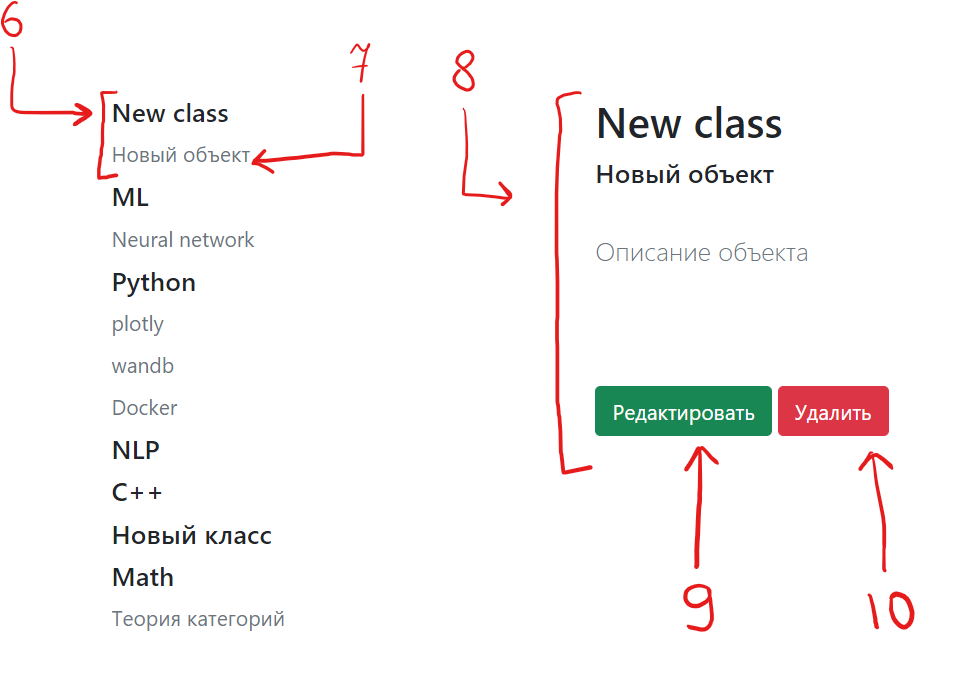

# Skill map
Skill map application is designed to create a list of classes and objects.

## Usage (docker)

Example for debian-based system:
```shell
apt-get install docker docker.io docker-compose
```
Alternatively, you can visit Docker documentation (https://docs.master.dockerproject.org/desktop/windows/) for the installation instructions.

When you have installed docker, you need to clone the repository and run docker-compose in the terminal:
```shell
git clone https://github.com/nortem/skill-map.git
cd skill-map/
docker-compose up
```
The app will be available on http://localhost:5000/ (port = 5000).

## Usage (no docker) 
The app can be launched without docker. 
Requirements:
- Python 3.7.
- Python packages specified in the requirements.txt (/web/requirements.txt).
- Redis server 

You need set the correct host:port settings for the redis db. (/web/app/my_config.py).


# Example

"Создать запись"

How can you add a class?

1. Write the name of the class in the box
2. Click the button "Добавить"


How can you add a object?

3. All added classes will appear in the class selection window. Select the class to which the object belongs.


4. Fill in all the fields. Information about the object can be left blank.
5. Click the button "Добавить"


"Просмотр записей"

6. On the left there will be a list of classes and objects belonging to them.
7. You can click on the object.
8. Information about the object will appear here.
9. Сhange the information about the object, click on the "Редактировать" button and fill in the information as in paragraph 3.
10. Delete the object.


"Просмотр карты"

11. Added class.
12. Number of objects + 1.
13. The "Новый класс" class has no objects

